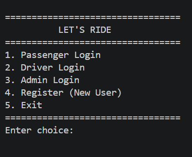
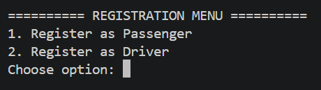
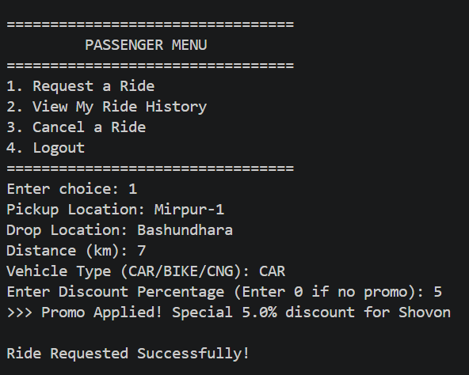
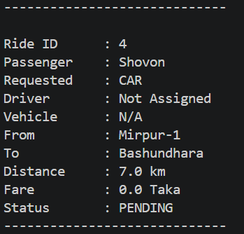
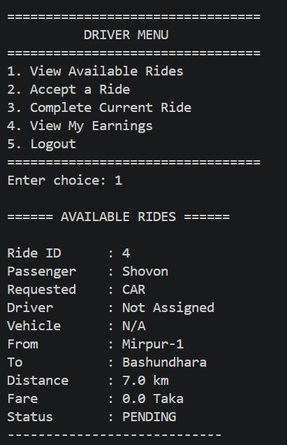
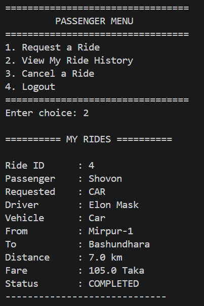
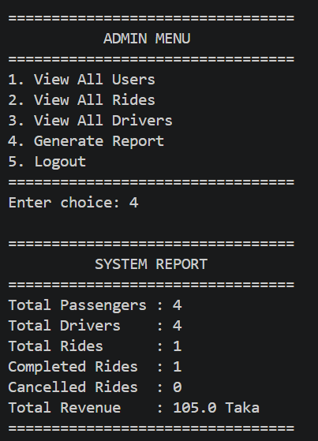

# 🚗 Let's Ride — Ride Sharing System (Java + OOP + MySQL)

A console-based ride-sharing platform built in Java, demonstrating core **Object-Oriented Programming (OOP)** principles with a real **MySQL** database backend.

Built as a **2nd Semester Object-Oriented Programming (OOP)** course project.

---

## 📌 Overview

**Let's Ride** simulates a simplified ride-sharing service (similar to Uber or Pathao) where:

- 👤 Passengers can register, log in, and request rides.
- 🚗 Drivers can accept and complete ride requests.
- 🛡️ Admins can monitor users, drivers, and rides.
- 💾 All data is stored permanently in a MySQL database.

---

## ✨ Features

- User registration and login
- Role-based access (Passenger, Driver, Admin)
- Ride request with pickup & drop location
- Vehicle selection (Car, Bike, CNG)
- Ride lifecycle management
  - Request
  - Accept
  - Complete
  - Cancel
- Fare calculation based on vehicle type
- Driver earnings tracking
- Admin dashboard
- Persistent MySQL database storage

---

## 🧠 OOP Concepts Used

| Concept | Implementation |
|---------|----------------|
| Encapsulation | Private fields with getters and setters |
| Inheritance | Passenger, Driver, Admin → User; Car, Bike, CNG → Vehicle |
| Polymorphism | Method overriding (`getRole()`, `calculateFare()`) and method overloading (`requestRide()`) |
| Abstraction | `User` and `Vehicle` are abstract classes |
| Composition | Driver has a Vehicle, Ride has Passenger and Driver |

---

## 🏗️ Project Architecture

```
com.ride
│
├── Main.java          // Console UI
├── models/            // Domain classes
├── service/           // Business logic
└── database/          // Database connection
```

### Layer Responsibilities

- **Models** → OOP classes
- **Service** → Business logic and JDBC operations
- **Database** → MySQL connection management

---

## 🛠️ Tech Stack

- Java (JDK 21)
- MySQL
- JDBC (mysql-connector-j)
- Maven

---

## 🗄️ Database Schema

| Table | Purpose |
|------|---------|
| users | Stores Passengers, Drivers and Admins |
| vehicles | Stores vehicle information |
| drivers_extra | Driver-specific details |
| rides | Stores ride requests and ride history |

**SQL Script:** `RideShare.sql`

---

## 🚀 Getting Started

### Prerequisites

- JDK 21+
- MySQL Server
- Maven

### Clone Repository

```bash
git clone https://github.com/AR-Rahman-Iftekhar-Shovon/letsride.git
cd letsride
```

### Create Database

```bash
mysql -u root -p < RideShare.sql
```

### Configure Database

Copy:

```bash
cp db.properties.example db.properties
```

Edit:

```properties
db.url=jdbc:mysql://localhost:3306/ride_sharing_db
db.user=root
db.password=your_password
```

> `db.properties` is ignored by Git, so your password won't be uploaded.

### Build & Run

```bash
mvn clean install
mvn compile exec:java
```

---

## 📋 Sample Menu

```text
=================================
        LET'S RIDE
=================================
1. Passenger Login
2. Driver Login
3. Admin Login
4. Register
5. Exit
=================================
```

---
## 📸 Screenshots

### Main Menu


### Registration


### Passenger Menu & Request a Ride


### Ride History


### Driver Menu & Available Rides


### Passenger Menu After Completed the Ride


### System Report



## 🔮 Future Improvements

- Password hashing
- JUnit testing
- REST API
- Ride rating & review system
- GUI version (JavaFX/Swing)
- Online payment integration

---

## 📄 License

This project is licensed under the **MIT License**.

---

## 👨‍💻 Author

**AR Rahman Iftekhar Shovon**

Computer Science & Engineering (CSE)  
2nd Semester OOP Course Project
